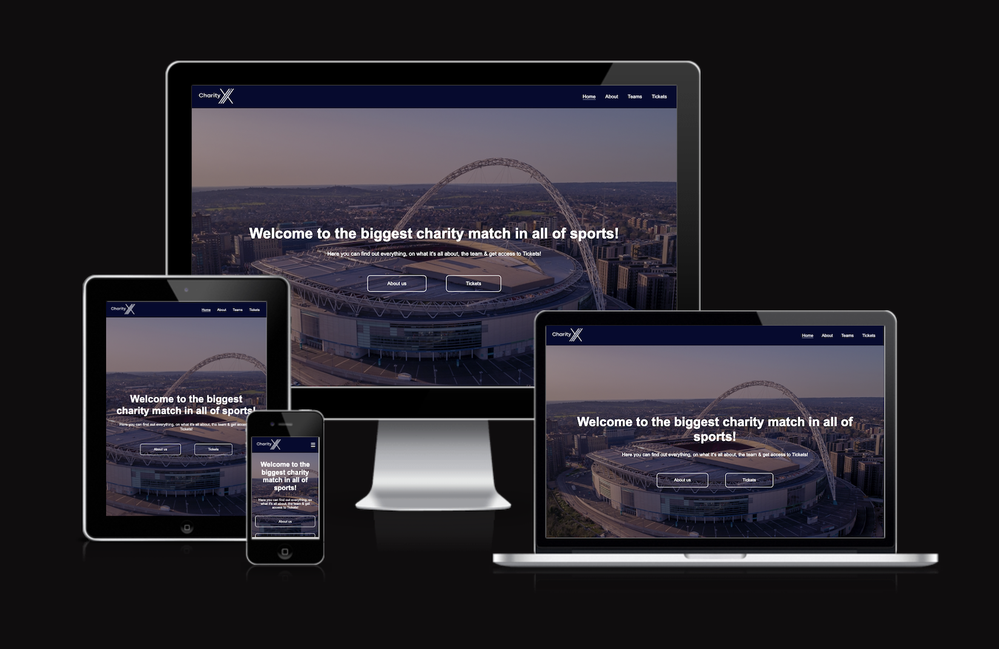

README

# [CHARITY XI](https://firstnamejonas.github.io/charity-xi)

When you think of CharityXI, think about the best football match ever, with the biggest stars on the planet, where all your family and friends can take part and all the money is donated to good causes!

This website is designed to give ticket buyers all the information they need to encourage them to buy tickets and find out more about the project. Visitors to the website will be able to find out which causes are being donated to, the venue of the event, which players are taking part and when tickets will be on sale. The goal of the website is to have a newsletter form at the end of the website, which informs customers when tickets will be sold.

## UX

User Experience (UX) plays a crucial role in shaping and implementing the CharityXI website. My aim is not only give out information about the charity project but also to create an engaging and user-friendly environment that inspires visitors to actively participate in the project.
My UX design process has been carefully crafted to ensure that users navigate seamlessly through the website, understand the mission of CharityXI, and ultimately feel motivated to purchase tickets and sign up for the presale. 

The process includes:		
- Understanding what the costumer want to be informed about to get interested, this forms the foundation for a design that strategically caters to the interests of the visitors.
- I’ve structured the website to make information intuitively accessible. This involves clear navigation paths to ensure visitors effortlessly move through the various sections of the website.
- The visual appearance has been designed to be easy to understand the key messages and mission behind CharityXI and get informations quick, as well as ticket access

### Colour Scheme

- `white` used for primary text.
- `#050A30` used for primary background color

I used those colors, because this oxford blue stands for trust and the white stands in very good contrast to that. 

[coolors.co](https://coolors.co/050a30-ffffff)

### Typography

- Arial, with a backfall font of sans-serif, was used for all text on the page.

- [Font Awesome](https://fontawesome.com) icons were used throughout the site, such as the social media icons in the footer and the icons in the about us section.

## User Stories

### New Site Users

- As a new site user, I would like to know who’s participating in the CharityXI match, so that I can decide whether to buy tickets or not.
- As a new site user, I would like to know where the CharityXI match is taking place, so that I know if I have to plan any travels in advance.
- As a new site user, I would like to be informed about the project CharityXI, so that I can tell my friends and / or family more about it.

### Returning Site Users

- As a returning site user, I would like to show the information to family and / or friends, so that I can convince them to buy tickets with me.

## Wireframes

### Mobile Wireframes

 Click here to see the Mobile Wireframes 

#### Home 

#### Teams 

#### Tickets 

### Tablet Wireframes

 Click here to see the Tablet Wireframes 

#### Home 

#### Teams 

#### Tickets 

### Desktop Wireframes

 Click here to see the Desktop Wireframes 

#### Home 

#### Teams 

#### Tickets 

## Features

### Existing Features

- **Feature #1: Navigation Bar**

- The navigation bar has a consistent look and placement on all three pages of the website supporting easy navigation. It includes a simple Logo, Home page, About Us section, Teams page and Tickets page links and is responsive on multiple screen sizes. On small devices the menu displays as an icon from [Font Awesome](https://fontawesome.com), which is well known as the menu icon across the web. The menu opens on a click and displays in the middle under the header of every page.

- **Feature #2: Hero Section**

- The Hero Section features a background image showcasing the iconic Wembley Stadium, providing visitors with an immediate visual connection to the event's location. It includes a welcoming headline, a brief introduction, and two buttons facilitating easy navigation to gather information. On the Teams and Tickets pages, the Hero Section serves as a visual indicator, ensuring visitors instantly understand the page's focus.

- **Feature #3: About Us Section**

- The About Us Section offers a concise overview, summarizing CharityXI's mission and values. Additionally, a visually compelling video has been created to emotionally engage and summarize the essence of the About Us Section for visitors.

- **Feature #4: Buttons**

- Strategically placed at the end of most sections, buttons simplify navigation throughout the site, enhancing the user experience and making it easier for visitors to explore different aspects of CharityXI.

- **Feature #5: Wembley Section**

- The Wembley Section is designed to inform visitors about the event's location, enabling them to plan potential travel arrangements accordingly. This section provides essential details about where the event takes place.

- **Feature #6: Teams Presentation**
- The Teams Presentation employs the use of details-elements to conserve screen space, particularly on smaller devices, ensuring the page remains visually organized. This design choice enhances the overall user experience by maintaining clarity.

- **Feature #7: Tickets Form**
- As tickets are not yet available for purchase, a form has been implemented for potential customers to sign up for Early Bird Ticket Sales. Users need to provide their name, email, and favorite player. The last name is optional for newsletter sign-ups, and the favorite player selection is mandatory to personalize newsletter messages.

- **Feature #8: Footer**
- The Footer section directs users to CharityXI's social media channels, featuring an inspiring quote underscoring the charitable impact. To conclude the page seamlessly, the footer includes the CharityXI logo.

-**Feature #9: Confirmation Page**

- The visitor does only get to this page, by filling out the tickets form. He will as well be automatically brought back to the main home page after 10 seconds.

### Future Features

- Adding a Partners Page #1
    - On this page all the partners are listed apart from the video on the main page. Every partner has his on section, where they’re introduced to the visitor.
- Adding an own About Us Page #2
    - This page is for discovering more about the match, with pictures of the founders, how the idea came to life and just more content.
- Past Events #3
    - An Overview with pictures and videos of past CharityXI events

## Tools & Technologies Used

- [HTML](https://en.wikipedia.org/wiki/HTML) used for the main site content.
- [CSS](https://en.wikipedia.org/wiki/CSS) used for the main site design and layout.
- [CSS Flexbox](https://www.w3schools.com/css/css3_flexbox.asp) used for an enhanced responsive layout.
- [Balsamiq](https://balsamiq.com) used to create the wireframes during the design process.
- [Canva](https://www.canva.com) used for images & the creating of the video on the home page.
- [FontAwesome](https://fontawesome.com) used for icons.
- [Gitpod](https://www.gitpod.io/) used as the IDE for this project.
- [GitHub](https://github.com/) used as the respository for the projects code after being pushed from Gitpod.

## Testing

For all testing, please refer to the [TESTING.md](TESTING.md) file.

## Deployment

The site was deployed to GitHub Pages. The steps to deploy are as follows:

The live link can be found [here](https://firstnamejonas.github.io/charity-xi)

### Local Deployment

This project can be cloned or forked in order to make a local copy on your own system.

#### Cloning

You can clone the repository by following these steps:

1. Go to the [GitHub repository](https://github.com/firstnamejonas/charity-xi) 
2. Locate the Code button above the list of files and click it 
3. Select if you prefer to clone using HTTPS, SSH, or GitHub CLI and click the copy button to copy the URL to your clipboard
4. Open Git Bash or Terminal
5. Change the current working directory to the one where you want the cloned directory
6. In your IDE Terminal, type the following command to clone my repository:
	- `git clone https://github.com/firstnamejonas/charity-xi.git`
7. Press Enter to create your local clone.

Alternatively, if using Gitpod, you can click below to create your own workspace using this repository.

Please note that in order to directly open the project in Gitpod, you need to have the browser extension installed.
A tutorial on how to do that can be found [here](https://www.gitpod.io/docs/configure/user-settings/browser-extension).

#### Forking

By forking the GitHub Repository, we make a copy of the original repository on our GitHub account to view and/or make changes without affecting the original owner's repository.
You can fork this repository by using the following steps:

1. Log in to GitHub and locate the [GitHub Repository](https://github.com/firstnamejonas/charity-xi)
2. At the top of the Repository (not top of page) just above the "Settings" Button on the menu, locate the "Fork" Button.
3. Once clicked, you should now have a copy of the original repository in your own GitHub account!

### Local VS Deployment

There were no differences found.

## Credits

### Content

| Source | Location | Notes |
| --- | --- | --- |
| [Markdown Builder](https://tim.2bn.dev/markdown-builder) | README and TESTING | tool to help generate the Markdown files |
| [Code Institute](https://learn.codeinstitute.net/courses/course-v1:CodeInstitute+LRFX101+2023_Q2/courseware/e805068059af42af87681032aa64053f/7525117e5cd144daa2a7b0c57843bbee/?child=first) | Header of all HTML files | Helped me with the responsive header for mobile |
| [W3schools](https://www.w3schools.com/tags/att_link_rel.asp) | Head of all HTML files | information on how to add a favicon |
| [W3schools](https://www.w3schools.com/css/css_image_transparency.asp) | CSS file | Transparency using RGBA |
| [CSS-Tricks](https://css-tricks.com/forums/topic/anchor-tag-not-registering-margin-top/) | CSS file | forum to help fixing bug that anchor elements didn’t had enough space on mobile |
| [ChatGPT](https://chat.openai.com/) | HTML files | tool to help generate text ideas |

### Media

| Source | Location | Type | Notes |
| --- | --- | --- | --- |
| [UI.dev](https://ui.dev/amiresponsive?url=https://firstnamejonas.github.io/charity-xi) | Readme | image | Mockup of my website |
| [Canva](https://www.canva.com) | entire site | image | favicon on all pages |
| [Canva](https://www.canva.com) | entire site | image | logo on all pages |
| [Wembley Stadium](https://www.wembleystadium.com/about/sustainability) | home page | image | hero image background |
| [Sportschau](https://www.sportschau.de/fussball/frauen-em/wembley-stadion-london-100.html) | home page | image | image background wembley-section |
| [National Geographic](https://www.nationalgeographic.co.uk/history-and-civilisation/2017/11/how-global-football-began-with-a-0-0-draw) | confirmation page | image | hero image background |
| [Canva](https://www.canva.com) | tickets page | image | hero image background |
| [Canva](https://www.canva.com) | teams page | image | hero image background |
| [Canva](https://www.canva.com) | home page | video | video in about us section |
| [ManCity](https://www.mancity.com/players/ederson) | teams page | image | image besides the player name and information |
| [ManCity](https://www.mancity.com/players/kyle-walker) | teams page | image | image besides the player name and information |
| [FoxSports](https://www.foxsports.com/soccer/william-saliba-player-bio) | teams page | image | image besides the player name and information |
| [FootyRenders](https://www.footyrenders.com/premier-league/arsenal/gabriel-magalhaes-8/) | teams page | image | image besides the player name and information |
| [Pinterest](https://www.pinterest.de/pin/687713805576608377/) | teams page | image | image besides the player name and information |
| [DailyCannon](https://dailycannon.com/2021/01/odegaard-shirt-number-leaks-deal-official-within-hours/) | teams page | image | image besides the player name and information |
| [ManCity](https://www.mancity.com/players/kevin-de-bruyne) | teams page | image | image besides the player name and information |
| [FoxSports](https://www.foxsports.com/soccer/mohamed-salah-player) | teams page | image | image besides the player name and information |
| [FoxSports](https://www.foxsports.com/soccer/bukayo-saka-player) | teams page | image | image besides the player name and information |
| [FoxSports](https://www.foxsports.com/soccer/jack-grealish-player) | teams page | image | image besides the player name and information |
| [ManCity](https://www.mancity.com/players/erling-haaland/news) | teams page | image | image besides the player name and information |
| [Eurosport](https://www.eurosport.de/fussball/pep-guardiola-wechsel-englische-nationalmannschaft-manchester-city-wechsel-fa-verband-neuer-trainer_sto9782617/story.shtml) | teams page | image | image besides the player name and information |
| [Pinterest](https://www.pinterest.de/pin/579979258239055898/) | teams page | image | image besides the player name and information |
| [FC Bayern](https://fcbayern.com/de/teams/profis/joshua-kimmich) | teams page | image | image besides the player name and information |
| [weltfussball.de](https://www.weltfussball.de/spieler_profil/sergio-ramos/) | teams page | image | image besides the player name and information |
| [DFB](https://www.dfb.de/datencenter/personen/antonio-ruediger/spieler) | teams page | image | image besides the player name and information |
| [FC Bayern](https://fcbayern.com/de/teams/profis/alphonso-davies) | teams page | image | image besides the player name and information |
| [Pinterest](https://www.pinterest.de/pin/76209418679188324/) | teams page | image | image besides the player name and information |
| [LaLiga](https://www.laliga.com/en-GB/player/jude-bellingham) | teams page | image | image besides the player name and information |
| [FC Bayern](https://fcbayern.com/de/teams/profis/leroy-sane) | teams page | image | image besides the player name and information |
| [weltfussball.de](https://www.weltfussball.de/spieler_profil/kylian-mbappe/) | teams page | image | image besides the player name and information |
| [weltfussball.de](https://www.weltfussball.de/spieler_profil/lionel-messi/) | teams page | image | image besides the player name and information |
| [Biography](https://www.biography.com/athletes/cristiano-ronaldo) | teams page | image | image besides the player name and information |
| [SWP](https://www.swp.de/panorama/personen/juergen-klopp-der-trainer-im-portraet-64342329.html) | teams page | image | image besides the player name and information |

## Acknowledgements

- I would like to thank my family & my partner Caro, for believing in me, and allowing me to make this transition into software development.
- I would like to thank my Code Institute mentor, [Tim Nelson](https://github.com/TravelTimN) for his support throughout the development of this project, giving me confidence and valuable advice!
- I would like to thank the [Code Institute Slack community](https://code-institute-room.slack.com) for the moral support; it kept me going.
