# Testing

Return back to the [README.md](README.md) file.

Welcome to the testing section of my project documentation! In this segment, my aim is to assure that I’ve undertaken thorough testing to confidently affirm the effective functionality of my site, CharityXI. Throughout this documentation, I’ll delve into each project feature, ensuring they operate as intended. My commitment is to provide users with an uncomplicated and seamless experience, facilitating the achievement of their goals on CharityXI.

## Code Validation

### HTML

I have used the recommended [HTML W3C Validator](https://validator.w3.org) to validate all of my HTML files. All HTML files were tested using the live deployed site!

| Page | W3C URL | Screenshot | Notes |
| --- | --- | --- | --- |
| Home | [W3C](https://validator.w3.org/nu/?doc=https%3A%2F%2Ffirstnamejonas.github.io%2Fcharity-xi%2F) | 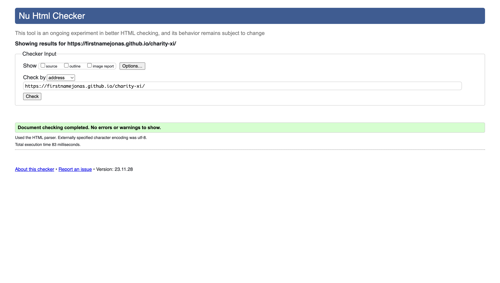 | No errors or warnings to show. |
| Teams | [W3C](https://validator.w3.org/nu/?doc=https%3A%2F%2Ffirstnamejonas.github.io%2Fcharity-xi%2Fteams.html) | 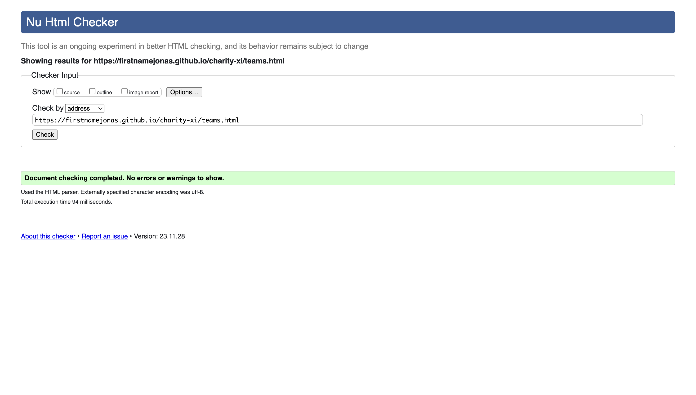 | No errors or warnings to show. |
| Tickets | [W3C](https://validator.w3.org/nu/?doc=https%3A%2F%2Ffirstnamejonas.github.io%2Fcharity-xi%2Ftickets.html) |  | No errors or warnings to show. |
| Confirmation | [W3C](https://validator.w3.org/nu/?doc=https%3A%2F%2Ffirstnamejonas.github.io%2Fcharity-xi%2Ftickets.html) | 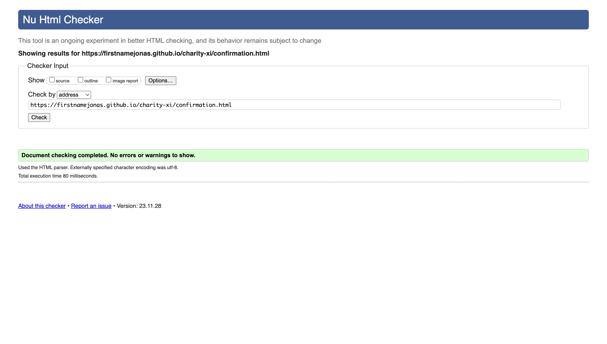 | No errors or warnings to show. |

### CSS

I have used the recommended [CSS Jigsaw Validator](https://jigsaw.w3.org/css-validator) to validate all of my CSS files. All CSS files were tested using the live deployed site!

| File | Jigsaw URL | Screenshot | Notes |
| --- | --- | --- | --- |
| style.css | [Jigsaw](https://jigsaw.w3.org/css-validator/validator?uri=https%3A%2F%2Ffirstnamejonas.github.io%2Fcharity-xi%2Findex.html&profile=css3svg&usermedium=all&warning=1&vextwarning=&lang=de#warnings) | 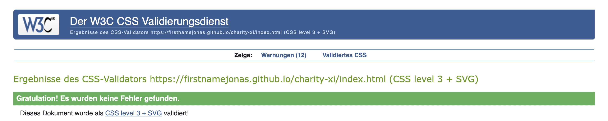 | Pass: No Errors // 12 Warnings for same color on button, this does not effect the visibility |

## Browser Compatibility

I've tested my deployed project on multiple browsers to check for compatibility issues.

| Browser | Home | Teams | Tickets | Confirmation | Notes |
| --- | --- | --- | --- | --- | --- |
| Chrome | 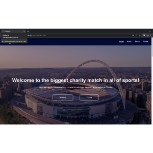 | 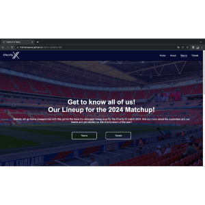 | 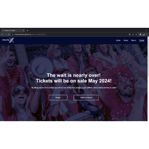 | 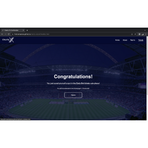 | Works as expected |
| Firefox | 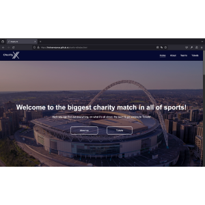 | 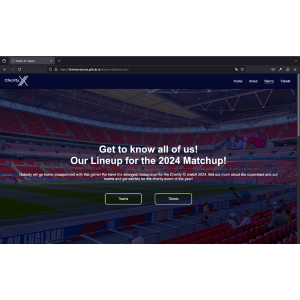 |  | 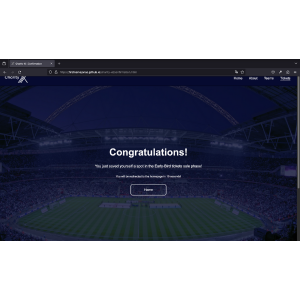 | Works as expected |
| Safari | 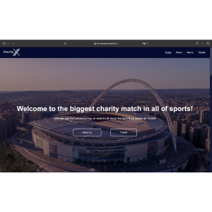 | 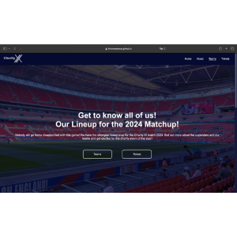 | 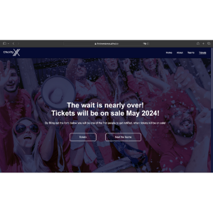 | 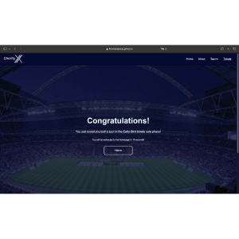 | Works as expected |

## Responsiveness

I've tested my deployed project on multiple devices to check for responsiveness issues.

| Device | Home | About | Contact | etc | Notes |
| --- | --- | --- | --- | --- | --- |
| Mobile (DevTools) | 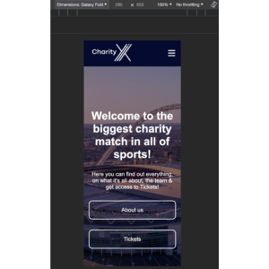 | 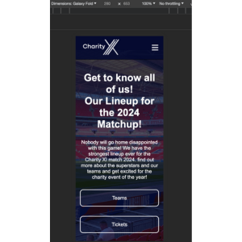 | 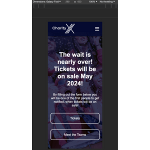 | 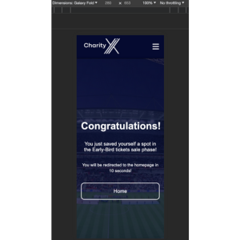 | Works as expected |
| Tablet (DevTools) | 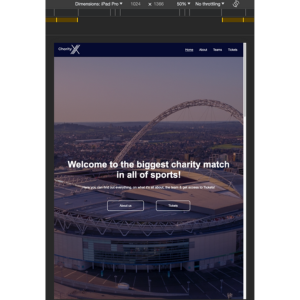 | 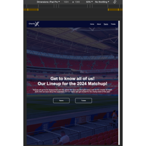 | 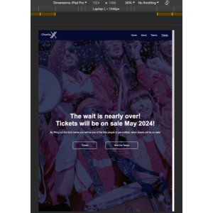 | 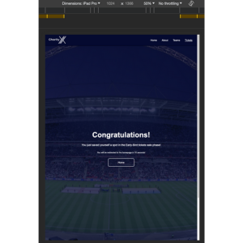 | Works as expected |
| Desktop |  |  |  |  | Works as expected |
| iPhone 13 | 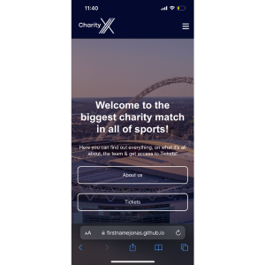 | 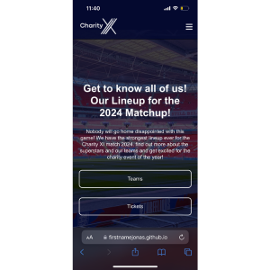 | 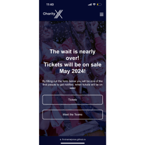 | 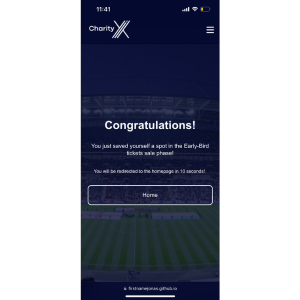 | Works as expected |

## Lighthouse Audit

I've tested my deployed project using the Lighthouse Audit tool to check for any major issues.

| Page | Mobile | Desktop | Notes |
| --- | --- | --- | --- |
| Home | 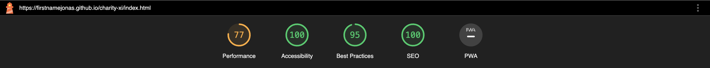 | Lower performance due to video file and logo|
| Teams | 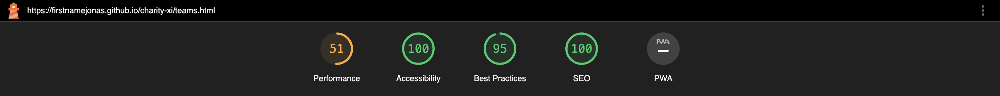 | Low performance score due to large images |
| Tickets | 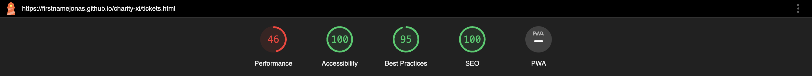 | Low performance score due to large images |
| Confirmation | 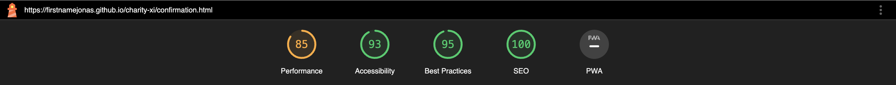 | Lower accessibility due to auto refresh of the page |

## User Story Testing

| User Story | Screenshot |
| --- | --- |
| As a new site user, I would like to know who’s participating in the CharityXI match, so that I can decide whether to buy tickets or not. |  |
| As a new site user, I would like to know where the CharityXI match is taking place, so that I know if I have to plan any travels in advance. |  |
| As a new site user, I would like to be informed about the project CharityXI, so that I can tell my friends and / or family more about it. | The Website as a whole functions as a presantation tool for this case |
| As a returning site user, I would like to show the information to family and / or friends, so that I can convince them to buy tickets with me. | The Website as a whole functions as a presantation tool for this case |

## Bugs / Fails

- Bad performance due to slow response time because of large images“

    
    

- To get a higher score for performance, I changed my hero images from .svg to .png

    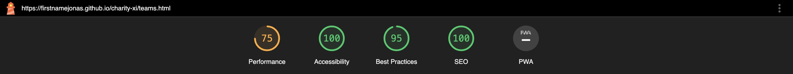
    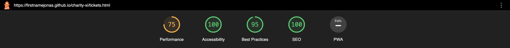

## Unfixed Bugs

There are no remaining bugs that I am aware of.